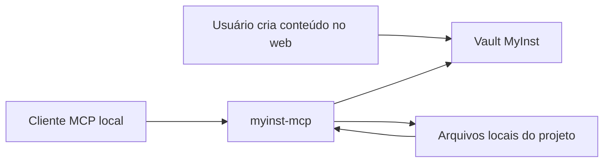

# MyInst

MyInst é um vault open source para armazenar, versionar e sincronizar contexto agentic entre projetos, workspaces, dispositivos e clientes MCP.

Ele centraliza `skills`, `instructions`, `agents`, `hooks`, `memory`, `snippets` e configurações de clientes em um backend próprio, com interface web, API, CLI e MCP server local.

## O que o MyInst resolve

Equipes pequenas e usuários avançados costumam espalhar contexto em:

- `.claude/`
- `.codex/`
- `.cursor/`
- `AGENTS.md`
- `GEMINI.md`
- `.mcp.json`
- regras locais por projeto

O resultado é previsível: duplicação, divergência entre máquinas, dificuldade para restaurar contexto e muito trabalho manual para manter agentes consistentes.

O MyInst resolve isso com:

- vault central versionado
- organização por `workspace -> projeto -> pasta -> conteúdo`
- sync local-first via MCP
- importação de estruturas conhecidas de clientes
- busca, diff e restore
- API key única por conta

## Para quem é

- quem usa agentes de código em múltiplos projetos
- quem quer manter instruções versionadas e sincronizadas
- quem precisa self-hosting e controle sobre o backend
- quem quer um vault pessoal, não um marketplace público de prompts

## Como funciona



Fluxo operacional recomendado:

1. `myinst_pull` materializa o vault localmente.
2. O agente trabalha sobre arquivos reais no projeto.
3. `myinst_push` sincroniza mudanças de volta.
4. `myinst_search` fica como ferramenta auxiliar de descoberta.

## Componentes do produto

| Componente | Papel |
|------------|-------|
| `frontend` | Painel web para workspaces, projetos, conteúdo e API keys |
| `backend` | API Fastify com auth, busca, sync, versionamento e persistência |
| `packages/cli` | CLI para login, listagem, pull e push fora do fluxo MCP |
| `packages/mcp-server` | Servidor MCP local que conecta o cliente ao vault |
| `packages/shared` | Schemas Zod, tipos e contratos compartilhados |

## Compatibilidade de clientes

O MyInst agora trabalha com adapters em camadas de suporte.

| Cliente | Suporte | Escopo | Tipos nativos |
|---------|---------|--------|---------------|
| Claude Code | `full` | projeto | `skill`, `instruction`, `mcp_config`, `agent`, `hook`, `memory`, `snippet` |
| Codex | `full` | projeto e global | `skill`, `instruction`, `mcp_config` |
| Cursor | `partial` | projeto e global | `instruction`, `mcp_config` |
| Gemini CLI | `partial` | projeto e global | `instruction` |
| OpenCode | `partial` | projeto e global | `instruction`, `mcp_config` |
| Qwen Code | `partial` | projeto | `instruction` |
| Aider | `partial` | projeto e global | `instruction`, `mcp_config` |
| Antigravity | `experimental` | projeto e global | `instruction`, `mcp_config` |

Observação:
- `full` significa preservação direta da estrutura principal do cliente.
- `partial` significa import/export apenas do que o cliente tem estrutura estável.
- `experimental` exige cautela e mensagens explícitas de instabilidade.

## Estrutura do repositório

```text
MyInst/
├── backend/
├── frontend/
├── packages/
│   ├── cli/
│   ├── mcp-server/
│   └── shared/
├── deploy/
├── docs/
├── docker-compose.yml
├── docker-compose.vps.yml
└── README.md
```

## Stack

- Linguagem: TypeScript
- Backend: Fastify
- Frontend: React 19 + Vite
- Banco: PostgreSQL + Drizzle ORM
- Validação: Zod
- Auth: JWT + API key + OAuth opcional
- Monorepo: pnpm workspaces + Turborepo
- Testes: Vitest
- MCP: `@modelcontextprotocol/sdk`

## Quick start local

### Requisitos

- Node.js 22+
- pnpm 10+
- PostgreSQL 16+
- Docker Desktop para fluxos com compose e alguns testes integrados

### Instalação

```bash
git clone git@github.com:davidassef/MyInst.git
cd MyInst
cp .env.example .env
pnpm install
pnpm db:push
pnpm dev
```

Ambiente local:

- API: `http://localhost:3000`
- Frontend: `http://localhost:5173`

## Configuração do MCP

Instalação:

```bash
npm install -g @myinst/mcp-server
```

Exemplo de configuração:

```json
{
  "mcpServers": {
    "myinst": {
      "command": "myinst-mcp",
      "env": {
        "MYINST_API_KEY": "myinst_sua_key_aqui",
        "MYINST_SERVER": "https://api-myinst.lotoscore.com.br"
      }
    }
  }
}
```

## Tools MCP

| Tool | Papel |
|------|-------|
| `myinst_list_workspaces` | lista workspaces do usuário |
| `myinst_list_projects` | lista projetos do workspace |
| `myinst_list_sync_targets` | detecta clientes e estruturas sincronizáveis locais |
| `myinst_pull` | materializa o vault em formato canônico ou nativo |
| `myinst_push` | envia mudanças locais detectadas para o vault |
| `myinst_import` | importa estruturas locais para o vault |
| `myinst_replicate_client_profile` | replica configurações globais compatíveis entre clients suportados |
| `myinst_search` | descoberta pontual por busca |
| `myinst_status` | mudanças temporais no vault |

## Fluxos de uso

### 1. Fluxo canônico local-first

```text
myinst_pull -> editar arquivos locais -> myinst_push
```

### 2. Descoberta multi-cliente antes do sync

```text
myinst_list_sync_targets
myinst_import ou myinst_push com clients explícitos
```

### 3. Exportação nativa para clientes

```text
myinst_pull targetFormat="native" clients=["cursor"]
```

### 4. Replicação entre clients

No v1, a replicação entre clients atua apenas sobre `Client Profiles` globais e só expõe pares suportados explicitamente.

Exemplo:

```text
myinst_replicate_client_profile sourceClient="claude" targetClient="opencode" dryRun=true
```

Política padrão:

- copiar apenas itens ausentes
- não sobrescrever o destino por padrão
- ignorar e relatar tipos sem equivalente nativo claro

## Compatibilidade de replicação entre clients

| Origem | Destino | Estado no v1 | Observação |
|--------|---------|--------------|------------|
| Claude | OpenCode | `suportado` | replica apenas `instruction` |
| Codex | OpenCode | `suportado` | replica apenas `instruction` |
| Claude | Codex | `planejado` | fora do v1 |
| Codex | Claude | `planejado` | fora do v1 |
| OpenCode | Claude | `planejado` | fora do v1 |
| OpenCode | Codex | `planejado` | fora do v1 |
| Cursor | OpenCode | `não suportado no v1` | feature futura |
| Gemini | OpenCode | `não suportado no v1` | feature futura |
| Qwen | OpenCode | `não suportado no v1` | feature futura |
| Aider | OpenCode | `não suportado no v1` | feature futura |
| Antigravity | OpenCode | `não suportado no v1` | feature futura |

## Workspaces

O modelo atual é:

```text
usuário -> workspaces -> projetos -> pastas -> conteúdos
```

Padrões do sistema:

- API keys continuam no nível da conta
- rotas legadas ainda usam `workspace default -> project default`
- o MCP pode acessar todos os workspaces da conta com uma única API key

## Branding local não versionado

O frontend suporta override local de marca sem afetar forks do projeto:

- base pública: `frontend/public/brand.default/`
- override local ignorado por git: `frontend/public/brand.local/`
- exemplo: `frontend/public/brand.local.example/manifest.example.json`

Se `brand.local/manifest.json` existir, ele vence o manifest padrão em:

- nome do app
- tagline
- logo lateral
- logo mark
- favicon

## Variáveis de ambiente

Consulte [`.env.example`](./.env.example).

Campos críticos para produção:

- `DATABASE_URL`
- `JWT_SECRET`
- `APP_URL`
- `API_PUBLIC_URL`
- `CORS_ORIGIN`
- `WEB_OAUTH_SUCCESS_URL`
- `VITE_MYINST_API_BASE`

## Comandos importantes

```bash
pnpm dev
pnpm lint
pnpm build
pnpm test
pnpm validate
pnpm compose:check
pnpm release:check
pnpm prod:preflight
```

## Self-hosting e deploy

Documentação principal:

- [docs/self-hosting.md](./docs/self-hosting.md)
- [docs/go-live-checklist.md](./docs/go-live-checklist.md)
- [docs/mcp-server.md](./docs/mcp-server.md)
- [docs/publicacao-npm.md](./docs/publicacao-npm.md)

Padrão de deploy do projeto:

- sempre via `git push` e `git pull`
- sem cópia manual de arquivos para VPS
- API exposta em `https://api-myinst.lotoscore.com.br`

## Contribuindo

Leia [CONTRIBUTING.md](./CONTRIBUTING.md).

## Licença

AGPL-3.0.
